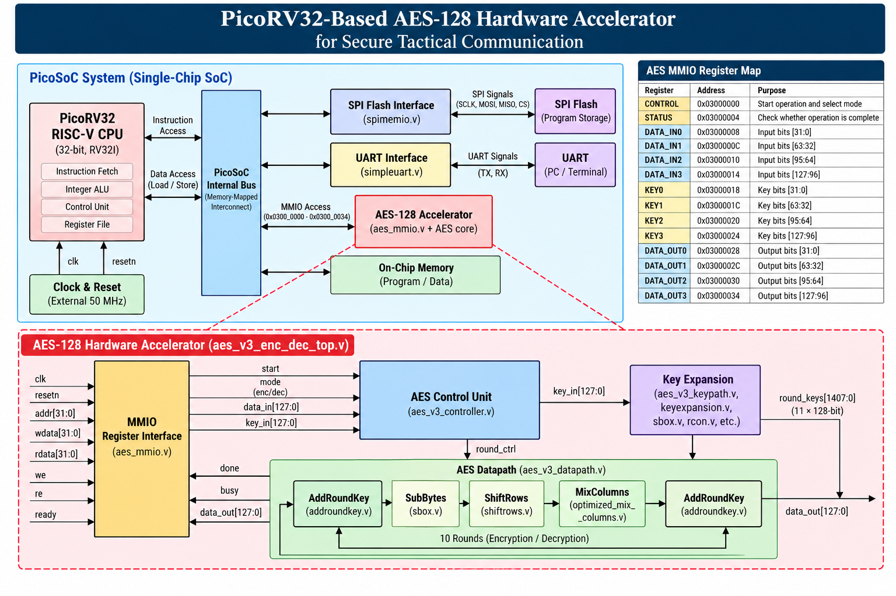

# PicoRV32-Based AES-128 Hardware Accelerator for Secure Tactical Communication

**FPGA-Based Cryptographic Acceleration | Embedded Systems | Hardware–Software Co-Design**

## 1. Project Overview

This project implements an AES-128 hardware accelerator integrated with a PicoRV32-based system-on-chip (SoC), targeting the **Real Digital Boolean Board featuring the AMD/Xilinx Spartan-7 XC7S50 FPGA**.

The design combines a RISC-V processor with a memory-mapped AES accelerator to support hardware-assisted cryptographic operations. Instead of performing every AES transformation through processor instructions, the processor configures the accelerator, supplies the plaintext or ciphertext and encryption key, initiates an operation, and reads the result through memory-mapped registers.

The project explores hardware–software co-design for secure embedded communication, with an emphasis on modular RTL design, processor–accelerator integration, and FPGA implementation.

## 2. Project Objectives

- Integrate an AES-128 accelerator with a PicoRV32-based SoC.
- Provide a memory-mapped interface for accelerator control, input data, key loading, status monitoring, and output retrieval.
- Support encryption and decryption mode selection through the accelerator control interface.
- Reuse the existing PicoRV32 processor and PicoSoC infrastructure.
- Develop and organize simulation evidence for functional verification.
- Prepare the design for FPGA synthesis, implementation, and hardware validation on the target board.

## 3. System Architecture

The system consists of the following major components:

- **PicoRV32 RISC-V CPU:** Executes software instructions and controls accelerator operations.
- **PicoSoC subsystem:** Provides the processor system and existing peripheral infrastructure.
- **AES MMIO interface:** Exposes control, status, input, key, and output registers to software.
- **AES-128 core:** Performs the cryptographic operation using the supplied data and key.
- **UART interface:** Provides a serial communication path through the existing SoC infrastructure.
- **FPGA platform:** Targets the Real Digital Boolean Board with a Spartan-7 XC7S50 device.

### Architecture Diagram

Add the system architecture image to `docs/images/architecture.png` and ensure that the filename matches the actual file in your repository.



### High-Level Operation

1. The PicoRV32 processor executes the control firmware.
2. Software writes the input block and AES key to the accelerator's memory-mapped registers.
3. Software configures the operation mode and asserts the start control.
4. The AES accelerator processes the input data.
5. Software polls the status register to determine when the operation is complete.
6. Software reads the resulting 128-bit block from the output registers.
7. Results may be reported through the UART interface when supported by the firmware.

## 4. AES-128 Hardware Accelerator

AES (Advanced Encryption Standard) is a symmetric-key block cipher. AES-128 operates on a **128-bit data block using a 128-bit key**.

The standard AES encryption algorithm includes the following transformations:

- **SubBytes:** Substitutes each state byte using the AES substitution table.
- **ShiftRows:** Cyclically shifts the rows of the AES state.
- **MixColumns:** Transforms each state column using arithmetic in the AES finite field.
- **AddRoundKey:** Combines the state with the round key using bitwise XOR.
- **Key Expansion:** Derives the round keys from the original 128-bit key.

AES-128 encryption uses an initial AddRoundKey operation, followed by nine full rounds and a final round without MixColumns.

The project integrates the AES core through an RTL interface containing data, key, start, mode, completion, and output signals. The exact internal implementation and supported decryption behavior should be confirmed against the finalized AES RTL and verification results.

## 5. Memory-Mapped Register Interface

The accelerator is assigned the base address `0x03000000`.

| Register | Address | Description |
|---|---|---|
| CONTROL | `0x03000000` | Starts an operation and selects the mode |
| STATUS | `0x03000004` | Reports operation completion status |
| DATA_IN0 | `0x03000008` | Input data bits [31:0] |
| DATA_IN1 | `0x0300000C` | Input data bits [63:32] |
| DATA_IN2 | `0x03000010` | Input data bits [95:64] |
| DATA_IN3 | `0x03000014` | Input data bits [127:96] |
| KEY0 | `0x03000018` | Key bits [31:0] |
| KEY1 | `0x0300001C` | Key bits [63:32] |
| KEY2 | `0x03000020` | Key bits [95:64] |
| KEY3 | `0x03000024` | Key bits [127:96] |
| DATA_OUT0 | `0x03000028` | Output data bits [31:0] |
| DATA_OUT1 | `0x0300002C` | Output data bits [63:32] |
| DATA_OUT2 | `0x03000030` | Output data bits [95:64] |
| DATA_OUT3 | `0x03000034` | Output data bits [127:96] |

The CPU accesses the accelerator through the SoC's internal memory-mapped interface. Firmware must use the register addresses and control/status bit definitions implemented in the RTL.

**Note:** The register offsets and data slices above describe the intended register map. Confirm control-bit encodings, status semantics, byte/word ordering, and bus-access behavior against the finalized RTL before using this table as a software specification.

## 6. Target Hardware and Development Tools

| Item | Description |
|---|---|
| FPGA development board | Real Digital Boolean Board |
| FPGA device | AMD/Xilinx Spartan-7 XC7S50-CSGA324-1 |
| Processor | PicoRV32 RISC-V CPU |
| Hardware description | Verilog/SystemVerilog, according to source files |
| Cryptographic algorithm | AES-128 |
| Processor–accelerator interface | Memory-mapped I/O |
| Serial interface | UART through the SoC |
| FPGA design tools | AMD Vivado Design Suite |
| Version control | Git and GitHub |

The final implementation must use the verified board clock frequency, correct pin assignments, and appropriate timing constraints for the selected hardware.

## 7. Repository Structure

```text
picorv32-aes128-accelerator/
├── rtl/
│   ├── picosoc_aes.v
│   ├── aes_mmio.v
│   └── ...
├── firmware/
│   └── README.md
├── constraints/
│   └── picosoc_aes_constraints.xdc
├── simulation_output/
│   ├── README.md
│   └── ...
├── docs/
│   ├── images/
│   │   └── architecture.png
│   └── ...
├── README.md
└── LICENSE
```

This is the intended organizational structure. Keep only filenames and folders that actually exist in the repository, and update the tree as the project develops.

## 8. Verification and Simulation

Simulation evidence is maintained in the `simulation_output/` directory.

Relevant evidence may include:

- AES encryption and decryption simulation results.
- Testbench waveforms.
- UART or console output demonstrating software interaction, where available.
- Additional functional verification screenshots.

Each result should be accompanied by a description of the test conditions, expected behavior, and observed output.

**Verification status:** Simulation and hardware-validation claims should be based on the actual test results committed to this repository. Screenshots alone should not be treated as proof of complete functional correctness unless the test inputs and expected outputs are documented.

## 9. Current Development Status

The project is organized around processor integration, an AES memory-mapped interface, and the AES hardware core.

| Component | Status |
|---|---|
| PicoRV32/PicoSoC integration | Present in the project RTL; integration requires build verification |
| AES MMIO interface | Defined around base address `0x03000000`; verify against finalized RTL |
| AES core integration | Connected through start, mode, data, key, done, and output signals |
| Firmware | Under development; source and build instructions to be added |
| Simulation evidence | To be documented alongside the actual test results |
| FPGA synthesis and implementation | To be confirmed from Vivado reports |
| On-board validation | To be confirmed by hardware testing |

This table should be updated before final evaluation to reflect the latest verified state of the project.

## 10. Security Scope and Limitations

This project demonstrates hardware-assisted AES-128 processing in an embedded SoC architecture. It is an educational and engineering prototype, not a complete secure tactical communication system.

AES encryption alone does not provide all the properties required for secure communication. A deployed system would also require appropriate authenticated encryption or message authentication, key management, secure key storage, protocol design, replay protection, and consideration of physical and side-channel attacks.

No claims of production-grade security, cryptographic certification, or measured performance improvement should be made without corresponding implementation and validation evidence.

## 11. Future Enhancements

- Complete and document the processor firmware.
- Verify encryption and decryption against independent AES-128 test vectors.
- Automate simulation and regression testing.
- Complete FPGA synthesis, implementation, and timing analysis.
- Validate the accelerator on the target development board.
- Measure latency, resource utilization, and throughput.
- Add authenticated communication support and improve key-management practices.

## 12. Getting Started

The following steps describe the intended workflow. Exact commands depend on the finalized source files, tool versions, and firmware build process.

1. Clone the repository.
2. Open the project in AMD Vivado Design Suite.
3. Add the RTL source files and the verified board constraints.
4. Configure the FPGA part and synthesis/implementation settings.
5. Run elaboration, synthesis, implementation, and timing checks.
6. Generate and program the FPGA bitstream after resolving build errors.
7. Build and load the processor firmware using the project's documented boot and loading procedure.
8. Run the documented simulation or hardware test cases.

```bash
git clone https://github.com/Elamathi-789/picorv32-aes128-accelerator.git
cd picorv32-aes128-accelerator
```

**Important:** The exact firmware boot source, memory layout, programming procedure, and required Vivado project setup must be documented once verified. The FPGA bitstream configuration process and the loading of software executed by the PicoRV32 processor are separate steps.

## 13. Author and Project Information

**Project:** PicoRV32-Based AES-128 Hardware Accelerator for Secure Tactical Communication

**Platform:** Real Digital Boolean Board — Spartan-7 XC7S50 FPGA

**Repository:** [GitHub Project Repository](https://github.com/Elamathi-789/picorv32-aes128-accelerator)

This project is developed for engineering and academic evaluation, focusing on embedded processor integration, cryptographic hardware acceleration, RTL design, and FPGA-based system implementation.
