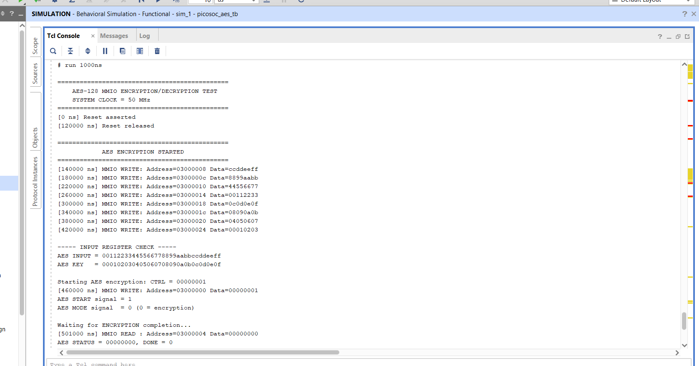
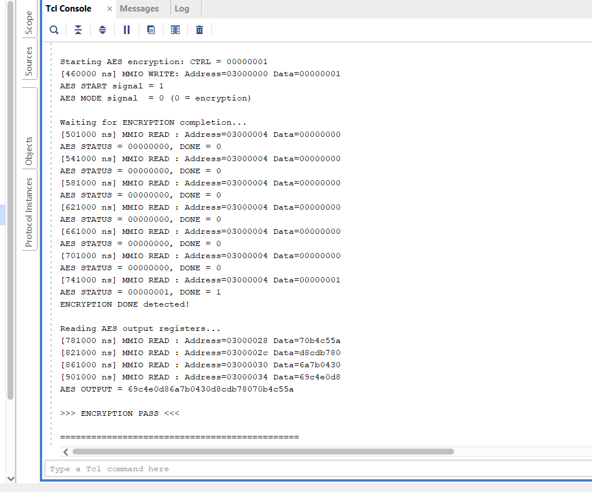
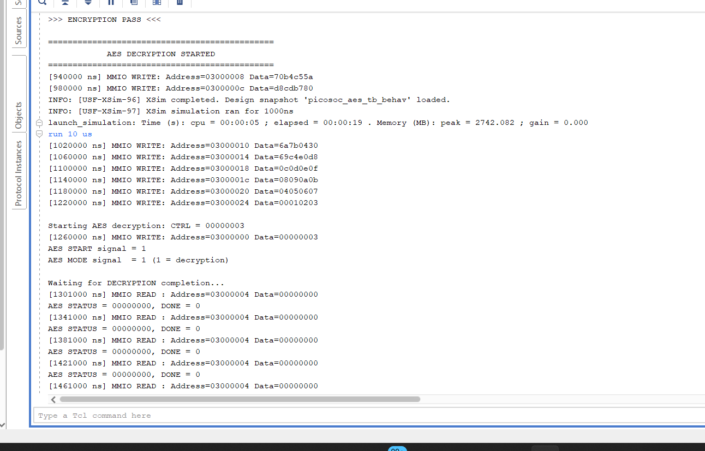
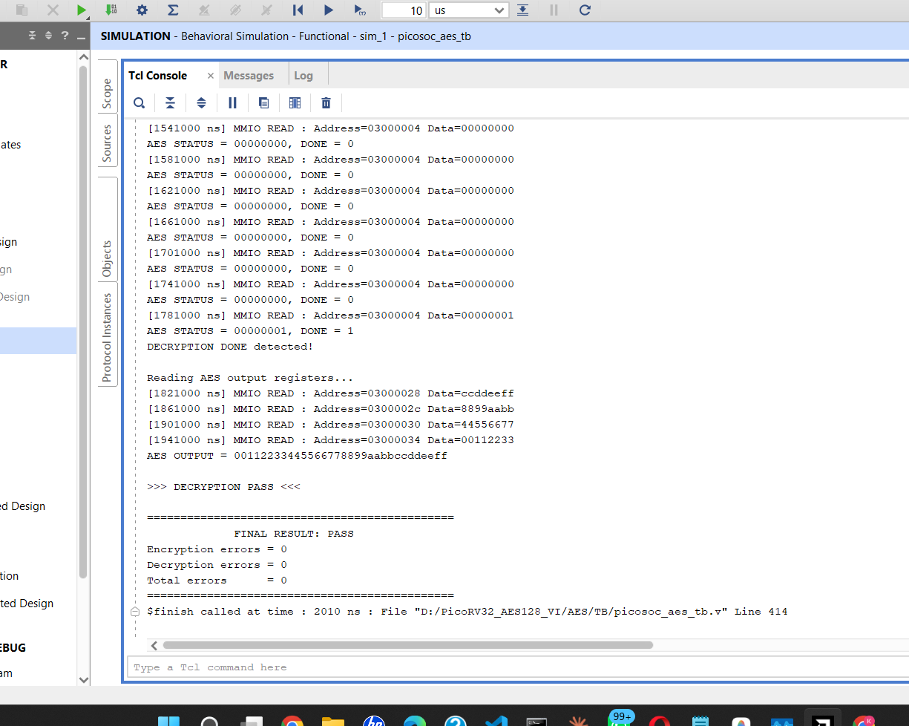
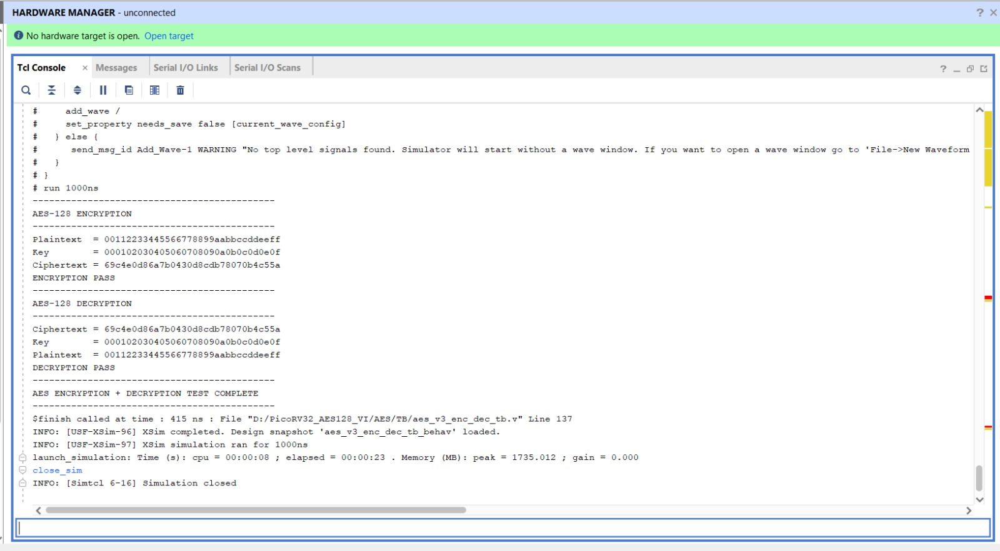

# AES-128 Encryption and Decryption Simulation

This screenshot shows the simulation results for the AES-128 encryption and decryption hardware.

## Simulation Waveform

## TCP Console Results
This screenshot shows the TCP console output captured during project testing.

### Console Output image 1

### Console Output image 2

### Console Output image  3

### Console Output image 4

### Console Output image 5

